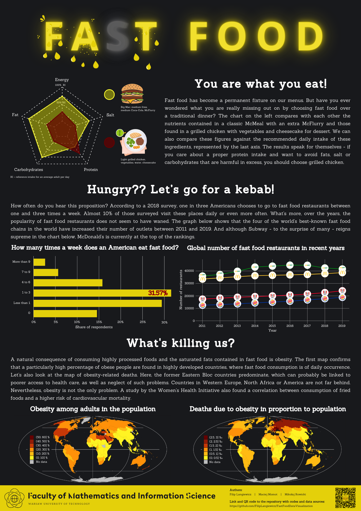

# Fast Food Data Visualization

Visualization of food data performed as a project task for Data Visualization Techniques course in the second year of Data Science studies at the Warsaw University of Technology. Authors: [@FilipLangiewicz](https://github.com/FilipLangiewicz), [@MaciejMomot](https://github.com/MaciejMomot) and [@MikolajRowicki](https://github.com/MikolajRowicki).

Data sources [here](https://github.com/FilipLangiewicz/FastFoodDataVisualization/tree/main/sources).

Our visualization - a poster in which plots were created using the dplyr and ggplot2 packages (mainly).

  

  <a href="https://github.com/FilipLangiewicz/FastFoodDataVisualization/blob/main/poster/Fast_Food_poster.pdf">PDF</a>

